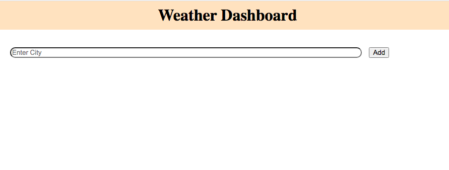
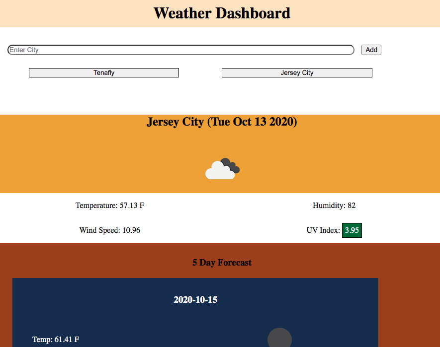

# Weather Dashboard

This Web App allows the user to add cities to select and view the current weather and for the next 5 days. Once entered, a city stays in local storage. Once the page is revisited, the last searched city is displayed.

## HW repository

https://github.com/saharVac/weather-dashboard/

## Deployed version of the app

https://saharvac.github.io/weather-dashboard/

## Running the application

Page is easily navigable, refer to the following screenshots:

## Websites used

I mostly referred back to jQuery documentation site:
https://api.jquery.com/

Using the OpenWeatherMap API, I referred often and regularly to the documentation:
https://openweathermap.org/api
